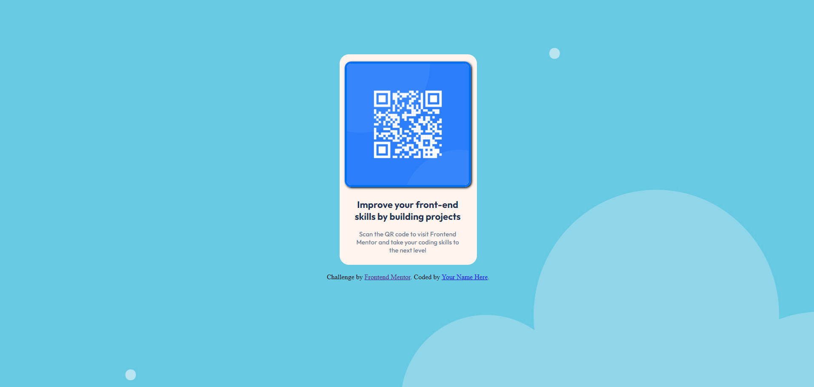

# Frontend Mentor - QR code component solution

This is a solution to the [QR code component challenge on Frontend Mentor](https://www.frontendmentor.io/challenges/qr-code-component-iux_sIO_H). Frontend Mentor challenges help you improve your coding skills by building realistic projects. 

## Table of contents

- [Overview](#overview)
  - [Screenshot](#screenshot)
  - [Links](#links)
- [My process](#my-process)
  - [Built with](#built-with)
  - [Other tools used](#other-tools-used)
  - [What I learned](#what-i-learned)
  - [Useful resources](#useful-resources)


## Overview

### Screenshot

![]
![]


### Links

- Solution URL: [Add solution URL here](https://your-solution-url.com)
- Live Site URL: [Add live site URL here](https://your-live-site-url.com)

## My process

### Built with

- Semantic HTML5 markup
- CSS custom properties
- Flexbox
- CSS Grid
- Mobile-first workflow

### Other tools used:

- Pesticide extension -> this is perfect to outline eacth element to better see the placement on the page  
- Developer tools -> available on any browser and is ideal for experimenting with changes to your page without affecting your code
- Imagecolorpicker -> used to choose a color and obtain the corresponding HTML Color Code for the selected pixel of an uploaded picture
- Convertingcolors -> perfect for converting colors and getting all the details about the converted color


### What I learned

1.Implementing animation to enhance the appearance of the QR code image:
```css
img {
    transition: width 2s, height 2s, transform 2s; 
}
```

2. Creating a hover effect to resize and shift the QR code image from its initial placement:
```css
img:hover {
    transform: scale(1.1) translate(21px, 22px); 
}
```


### Useful resources

- [Example resource 1](https://developer.mozilla.org/en-US/) - This resource proved valuable to me when I had to search for specific HTML or CSS elements for my project. I highly recommend this site to anyone looking to initiate their learning journey in HTML and CSS. It also offers a comprehensive set of learning materials tailored for novice developers and students.
- [Example resource 2](https://imagecolorpicker.com/) - This is perfect if you want to extract colors from images.
- [Example resource 3](https://convertingcolors.com/) -  Useful for converting between various color formats such as HSL, RGB, and more. Additionally, it offers a range of other color-related tools and apps to assist in various tasks.
- [Example resource 4](https://www.w3schools.com/) - This is additionally valuable for refining coding skills, and the "try me" section is beneficial if you wish to observe the code in action.
- [Example resource 5](https://css-tricks.com/almanac/) -Good site that offers a wealth of resources, tutorials, articles, and tools related to front-end web development, with an emphasis on CSS, HTML, JavaScript, and related technologies


